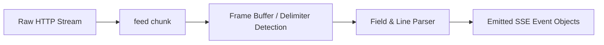

# genpark-sse-server-sent-events-protocol-parser-skill

High-performance Server-Sent Events (SSE) streaming frame parser strictly adhering to WHATWG / RFC standards for real-time LLM token streams.

## Architecture

## Features
- **Zero-Copy Delimiter Parsing**: Handles both `\r\n\r\n` and `\n\n` frame terminators.
- **Full Field Support**: Decodes `event`, `data`, `id`, and `retry` directives.
- **100% Python Standard Library**: No dependencies.
